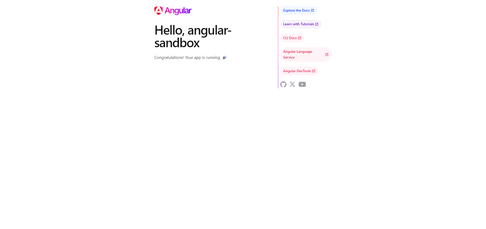

# Angularのインストール方法

ここではAngular v18についてのインストール方法をまとめる。

## オンライン

オンラインでAngularをローカル環境にインストールせずに使用したい場合は[Angular Playground](https://angular.dev/playground)を開いて実行する。

## ローカルセットアップ

### 前提条件

- Node.js： v18.19.1またはそれ以降
  - [Node.jsのインストールとVsCodeでの設定](https://qiita.com/bskcorona-github/items/ca2fee6103173145f07e)を参考
- テキストエディタ：Visual Studio Codeを推奨
- ターミナル： Angular CLI コマンドを実行するために必要

### Angular Cliのインストール

ターミナルにて以下のコマンドを実行

```sh
npm install -g @angular/cli
```

### 新規プロジェクトの作成

ターミナルにて以下のコマンドを実行

```sh
ng new <project-name>
```

プロジェクトオプションがいくつか聞かれるので必要なオプションを選択。(筆者は基本yes/noで答えるものはyesでスタイルシートはcssを選択した。)

完了すると以下のメッセージが出力される。

```sh
✔ Packages installed successfully.
 Successfully initialized git. 
 
または

✔ Packages installed successfully.
    Directory is already under version control. Skipping initialization of git.
```

### 新規プロジェクトをローカルで実行

ターミナルで、作成されたプロジェクトフォルダに移動。

```sh
cd <project-name>
```

プロジェクトを実行

```sh
npm start
```

すべて成功すると以下のメッセージが表示され、http://localhost:4200 にアクセスして、アプリケーションを確認することができる。

```sh
Watch mode enabled. Watching for file changes...
NOTE: Raw file sizes do not reflect development server per-request transformations.
  ➜  Local:   http://localhost:4200/
  ➜  press h + enter to show help
```

アクセスすると以下のような画面が表示される。


セットアップはこれで完了。  
srcs/の下を修正していくことで画面や挙動を変更することができる。
